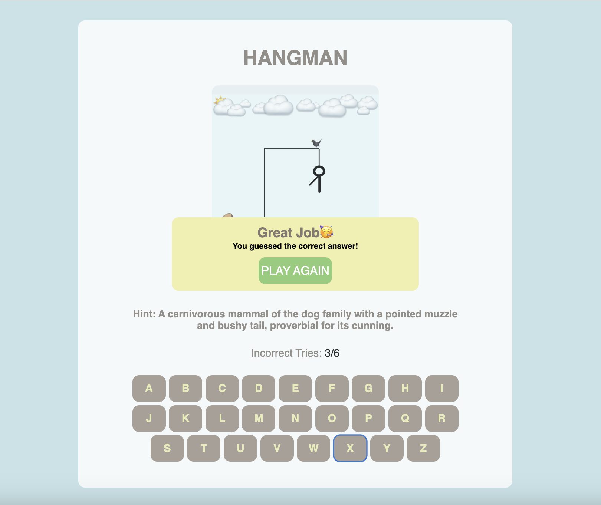

# HANGMAN_PROJECT

INTRO TO HANGMAN GAME: 
Hangman is a classic word-guessing game in which the player has 7 chances to guess the correct word. Each word is provided with a hint in order to guide your guess.

LIVE IMAGES OF GAME BEING PLAYED:

TECHNOLOGIES USED: HTML, CSS, JavaScript

PLAY HERE: https://mursal-r.github.io/HANGMAN_PROJECT/ 

NEXT STEPS: add various levels of difficulty by having player choose from a category, implement a timer, add motion animation.
